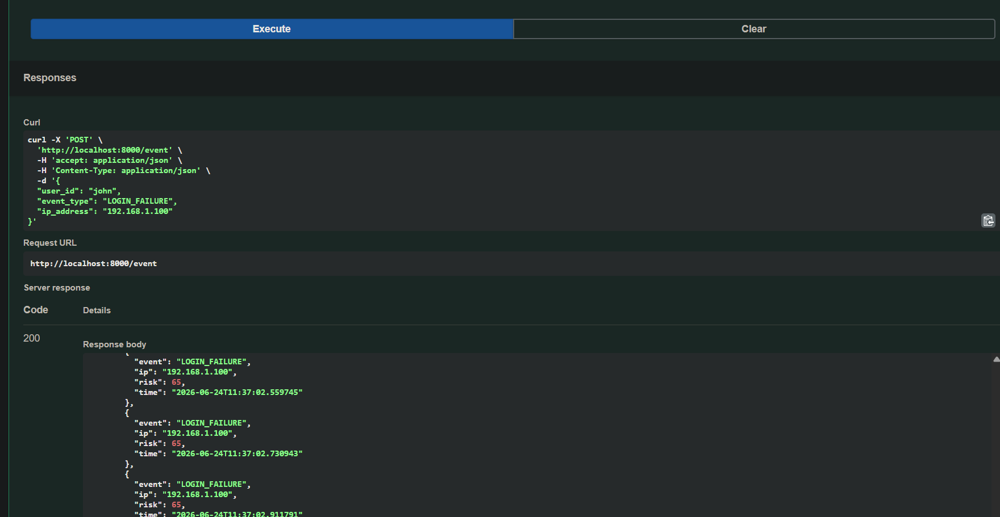
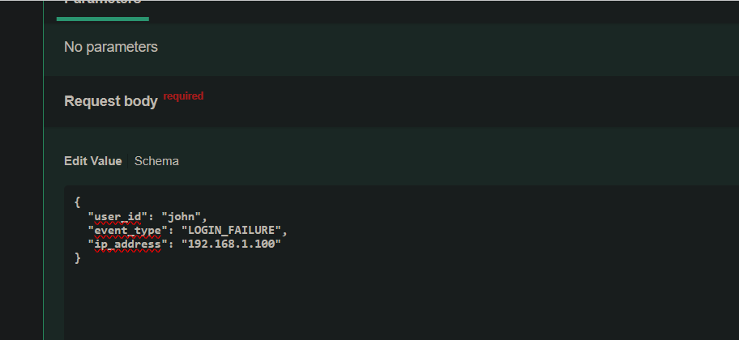

# 🛡️ SentinelIQ — Autonomous SOC Intelligence Platform


## Overview

SentinelIQ is an autonomous Security Operations Center (SOC) intelligence platform that performs real-time threat detection, attack correlation, UEBA risk scoring, dynamic attack graph generation, and automated incident response.

The platform simulates core capabilities commonly found in enterprise security solutions such as Splunk, Microsoft Sentinel, CrowdStrike, and SentinelOne while remaining lightweight, transparent, and fully self-hosted.

SentinelIQ ingests security telemetry, enriches events through behavioral analytics, maps activity to MITRE ATT&CK techniques, builds evolving attack graphs, and triggers autonomous defensive actions.

---

## 🚀 Live Deployment

**Public Deployment (Nosana Cloud)**

https://4u8pgm9fagp9ah4al48agqdvwoxypvsvn9rutoeccsvn.node.k8s.prd.nos.ci/docs

The live deployment exposes an interactive Swagger UI where events can be submitted and attack graphs generated in real time.

---

## 🔥 Key Features

### 🧠 AI-Driven Threat Analysis

* User & Entity Behavior Analytics (UEBA)
* Risk-based scoring engine
* Login anomaly detection
* Failed authentication detection
* Behavioral deviation analysis
* Threat classification

### 🕸 Dynamic Attack Graph

* Real-time node creation
* User-to-IP relationship mapping
* Weighted attack paths
* Attack chain reconstruction
* Graph summary analytics
* Relationship tracking

### ⚡ Correlation Engine

* Multi-event attack correlation
* MITRE ATT&CK mapping
* Brute force attack detection
* Threat confidence scoring
* Attack escalation analysis
* Behavioral pattern recognition

### 🚨 Autonomous Response Engine

* Automatic IP blocking simulation
* User quarantine simulation
* Escalation workflows
* Incident memory tracking
* Risk-based response actions

### 📊 SOC Dashboard

* Real-time monitoring
* Threat visualization
* Live graph updates
* Security event tracking
* SOC-style operational interface

---

## 🏗 Architecture

```text
Security Events
       │
       ▼
 FastAPI API Layer
       │
       ▼
 UEBA Risk Engine
       │
       ▼
 Correlation Engine
       │
       ▼
 MITRE ATT&CK Mapping
       │
       ▼
 Attack Graph Builder
       │
       ▼
 Autonomous Response Engine
       │
       ▼
 SOC Dashboard
```

---

## 🧪 Example Event

```json
{
  "user_id": "admin",
  "event_type": "LOGIN_FAILURE",
  "ip_address": "8.8.8.8"
}
```

---

## Example Detection Result

```json
{
  "risk": 65,
  "correlation": "CONFIRMED_ATTACK (T1110 - Brute Force)"
}
```

---

## 📸 Screenshots

### Live SOC Dashboard


### Attack Graph Visualization



### Threat Detection API



---

## 🐳 Docker Deployment

Build the image:

```bash
docker build -t sentineliq .
```

Run the container:

```bash
docker run -p 8000:8000 sentineliq
```

Open:

```text
http://localhost:8000/docs
```

---

## 💻 Local Installation

Clone repository:

```bash
git clone https://github.com/Drechi3/SentinelIQ.git
cd SentinelIQ
```

Install dependencies:

```bash
pip install -r requirements.txt
```

Run application:

```bash
python -m uvicorn main:app --reload
```

Open Swagger UI:

```text
http://localhost:8000/docs
```

---

## Example Detection Scenario

1. User repeatedly fails authentication.
2. Risk score increases.
3. Correlation engine maps activity to MITRE ATT&CK T1110.
4. Attack graph expands dynamically.
5. Autonomous response engine reacts.
6. Incident is stored for future analysis.

---

## Project Structure

```text
SentinelIQ/
│
├── agents/
├── backend/
├── frontend/
├── threat_intel/
├── alerts/
├── storage/
├── tests/
│
├── main.py
├── attack_graph.py
├── correlation_engine.py
├── response_engine.py
├── ai_risk_engine.py
├── dashboard.html
├── Dockerfile
├── requirements.txt
│
└── screenshots/
```

---

## Roadmap

* LLM-Powered SOC Analyst
* AI Incident Summaries
* Threat Intelligence Enrichment
* Multi-Tenant Dashboard
* Graph Database Integration
* Vector Memory Search
* Kubernetes Deployment
* Cloud SIEM Integrations
* Real-Time Threat Feeds

---

## Technologies

* Python 3.12
* FastAPI
* Docker
* HTML/CSS/JavaScript
* MITRE ATT&CK Framework
* UEBA Analytics
* Attack Graph Modeling
* Nosana Cloud Deployment

---

## Author

**Igboanugo David Ugochukwu**

Cybersecurity Researcher | Technical Writer | Security Engineer

GitHub:
https://github.com/Drechi3

LinkedIn:
https://www.linkedin.com/in/igboanugo-david-ugochukwu-73136220b

---

## License

MIT License
