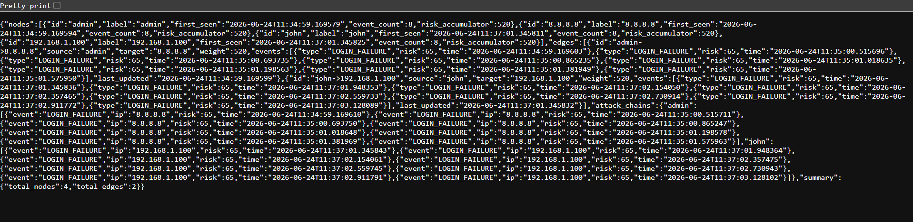

# 🛡️ SentinelIQ — Autonomous SOC Intelligence Engine


## Overview

SentinelIQ is an autonomous Security Operations Center (SOC) intelligence platform that performs real-time threat detection, attack correlation, risk scoring, attack graph generation, and automated incident response.

The platform simulates the core capabilities found in enterprise security products such as Splunk, Microsoft Sentinel, CrowdStrike, and SentinelOne while remaining lightweight and fully self-hosted.

SentinelIQ ingests security events, enriches them through behavioral analytics, maps activity to MITRE ATT&CK techniques, constructs evolving attack graphs, and triggers autonomous defensive actions.

---

# Key Capabilities

## 🧠 AI-Driven Threat Analysis

* User & Entity Behavior Analytics (UEBA)
* Risk-based scoring engine
* Login anomaly detection
* Behavioral deviation analysis
* Threat classification

## 🕸 Dynamic Attack Graph

* Real-time graph generation
* User-to-IP relationships
* Attack path visualization
* Event correlation chains
* Weighted edge scoring

## ⚡ Correlation Engine

* Multi-event attack correlation
* MITRE ATT&CK mapping
* Brute force detection
* Attack chain reconstruction
* Threat confidence scoring

## 🚨 Autonomous Response Engine

* Automatic IP blocking
* User quarantine simulation
* Rate limiting
* Escalation workflows
* Incident memory tracking

## 📊 SOC Dashboard

* Real-time monitoring
* Threat visualization
* Live graph updates
* Analyst narrative panel
* Security operations simulation

---

# Architecture

Event Stream
↓
FastAPI API Layer
↓
Risk Engine (UEBA)
↓
Correlation Engine
↓
Attack Graph Builder
↓
Autonomous Response Engine
↓
SOC Dashboard

---

# Example Event

```json
{
  "user_id": "admin",
  "event_type": "LOGIN_FAILURE",
  "ip_address": "8.8.8.8"
}
```

Example Response:

```json
{
  "risk": 65,
  "correlation": "CONFIRMED_ATTACK (T1110 - Brute Force)"
}
```

---

# Screenshots

## Live SOC Dashboard



## Attack Graph Visualization


## Threat Detection API


---

# Running Locally

Clone repository:

```bash
git clone https://github.com/Drechi3/SentinelIQ.git

cd SentinelIQ
```

Install dependencies:

```bash
pip install -r requirements.txt
```

Run:

```bash
python -m uvicorn main:app --reload
```

Open:

```text
http://localhost:8000/docs
```

---

# Docker Deployment

Build image:

```bash
docker build -t sentineliq .
```

Run container:

```bash
docker run -p 8000:8000 sentineliq
```

Access:

```text
http://localhost:8000/docs
```

---

# Example Detection Scenario

1. User repeatedly fails authentication.
2. Risk score increases.
3. Correlation engine maps activity to MITRE ATT&CK T1110.
4. Attack graph expands.
5. Autonomous response engine blocks attacker.
6. Incident stored in memory for future analysis.

---

# Project Structure

```text
SentinelIQ/
│
├── main.py
├── risk_engine.py
├── correlation_engine.py
├── graph_engine.py
├── response_engine.py
├── dashboard.html
├── Dockerfile
├── requirements.txt
└── screenshots/
```

---

# Future Roadmap

* LLM-powered SOC analyst
* Threat intelligence enrichment
* Multi-user dashboard
* Graph database integration
* Vector memory search
* Cloud-native deployment
* Kubernetes support
* Real-time SIEM connectors

---

# Author

Igboanugo David Ugochukwu

Cybersecurity Researcher | Technical Writer | Security Engineer

GitHub:
https://github.com/Drechi3

LinkedIn:
https://linkedin.com/in/igboanugo-david-ugochukwu-73136220b

---

